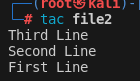

# Bash Challenges

## 1. 
### (a) Display the path of your current directory
**Command:** `pwd`  


### (b) List contents of the current directory
**Command:** `ls`  


### (c) List contents of the current directory (including hidden files)
**Command:** `ls -a`  


## 2. 
### (a) Create a new directory named 'a'
**Command:** `mkdir a`  


### (b) Move to the newly created directory 'a'
**Command:** `cd a`  


### (c) Create a blank file named 'file1'
**Command:** `touch file1`  


### (d) Display the file type of 'file1'
**Command:** `file file1`  


### (e) Add the line “Hello World” to 'file1'
**Command:** `echo Hello World > file1`  


### (f) Display the contents of 'file1'
**Command:** `cat file1`  


### (g) Display the file type of 'file1' again
**Command:** `file file1`  


## 3. 
### (a) Create 'file2' and add contents
**Command:** `cat > file2 ; cat file2`  


### (b) Display the contents of 'file2'
**Command:** `cat file2`  


### (c) Display 'file2' contents with reversed lines
**Command:** `tac file2`  


## 4. 
### (a) Concatenate 'file1' and 'file2' into 'file3'
**Command:** `cat file1 file2 > file3`  


### (b) Display the contents of 'file3'
**Command:** `cat file3`  


## 5. 
### (a) Create directories 'b/c' and 'd' in 'a'
**Command:** `mkdir -p b/c d`  


### (b) Copy 'd' to 'b/c'
**Command:** `cp -r d b/c`  


### (c) Delete 'd' in 'a'
**Command:** `rmdir d`  


### (d) Copy 'file3' to 'b/c/d'
**Command:** `cp file3 b/c/d`  


## 6. 
### (a) Rename 'file3' to 'file0' in 'b/c/d'
**Command:** `mv b/c/d/file3 b/c/d/file0`  


### (b) Move 'file0' to 'a'
**Command:** `mv b/c/d/file0 ../../..`  


## 7. 
### (a) Go to the home directory
**Command:** `cd ~`  


### (b) Create 'test' in 'a/b/c/d'
**Command:** `touch a/b/c/d/test`  


### (c) Find and display the path of 'test'
**Command:** `find -type f -name "test"`  


## 8. 
### (a) Get the man page of grep and save to 'grepman.txt'
**Command:** `man grep > ~/elatedvortex/readme/a/grepman.txt`  


### (b) Print lines containing 'FILE' (Case sensitive) in 'grepman.txt'
**Command:** `grep -w "FILE" ~/elatedvortex/readme/a/grepman.txt`  


## 9. 
### (a) Remove directory 'b' and its contents
**Command:** `rm -rf ~/elatedvortex/readme/a/b`  


### (b) Remove files starting with 'file'
**Command:** `rm -f ~/elatedvortex/readme/a/file*`  


## 10.
### (a) Download 'logo.png' from https://blog.bi0s.in/
**Command:** `wget https://blog.bi0s.in/assets/logo.png -O logo1.png`  


### (b) Download 'logo.png' using Python script
**Command:** `vim ~/elatedvortex/readme/a/10b.py; python ~/elatedvortex/readme/a/10b.py; ls`  
  
> Content of 10b.py:
```python
import requests
response = requests.get("https://blog.bi0s.in/assets/logo.png")
with open("logo2.png", 'wb') as file:
    file.write(response.content)
```

### (c) Display metadata of 'logo.png'
**Command:** `identify -verbose logo.png`  


## 11. 
### (a) Use traceroute on google.com
**Command:** `traceroute google.com`  


### (b) Find subdomains and IP addresses of google.com
**Command:** `nslookup google.com; nslookup -type=ns google.com`  


## 12. 
**Command:** `python -m http.server 8080`  


## 13. 
### (a) Scan your machine with nmap
**Command:** `nmap -iR 10`  


### (b) Scan IP address from https://tryhackme.com/room/furthernmap
**Command:** `nmap -v 10.10.14.137 -sV -sS -A`  


## 14. 
### (a) Start the server
**Command (Server):** `nc -nvlp <portno>`  


**Command (Client):** `nc <ip addr> <portno>`  


### (b) Transfer a file from server to client and display it
**Command (Server):** `touch test1; nc -v -w 30 <portno> < <filename>`  


**Command (Client):** `nc -v -w 3 <ip addr> <port no> < <filename>`  

